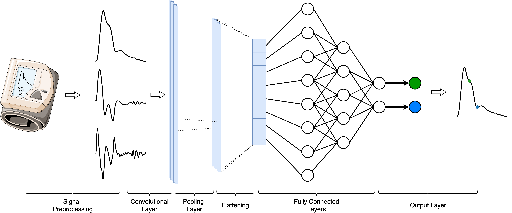
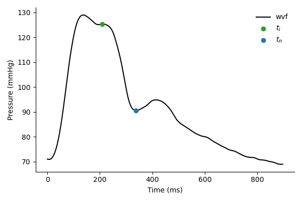
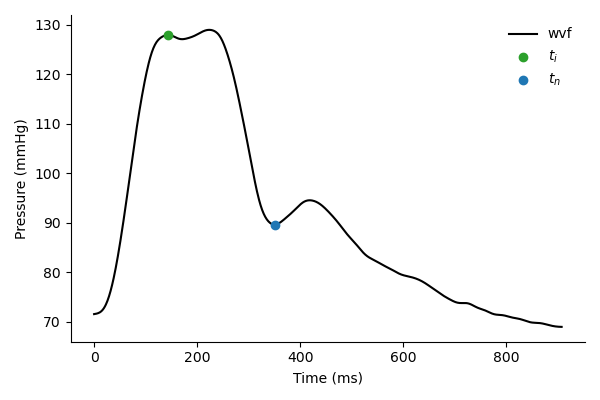

# IndexFinderML

This library contains the work for the machine learning-based automated cardiac pressure waveform fiducial point detection.



## Installation

To install and set up the project, follow these steps:

1. **Clone the repository**:
    ```bash
    git clone https://github.com/yourusername/IndexFinderML.git
    cd IndexFinderML
    ```

2. **Create a virtual environment** (optional but recommended):
    ```bash
    python3 -m venv venv
    source venv/bin/activate  # On Windows use `venv\Scripts\activate`
    ```

3. **Install the required dependencies**:
    ```bash
    pip install -r requirements.txt
    ```

4. **Verify the installation**:
    ```bash
    python -m unittest discover tests
    ```

You should now have the project set up and ready to use.

## Usage
First download a model checkpoint (if you cloned the library they should already be present in the src/pulse_indexer/pretrained_models folder). Then the model can be used with just a few lines of code to extract the fiducial points from a cardiac pressure waveform:

```python
from pulse_indexer import PimPredictor
checkpoint = 'augmented_model.pth'
pim = PimPredictor(checkpoint=checkpoint)
output = pim.predict(<your_waveform>, dt=1)
```

The output from PIM will be an numpy array containing the indices corresponding to the $t_i$ and $t_n$ points of the input waveform. See the examples on using the pulse-indexer model in the [notebooks](./notebooks/pim_predictor_example.ipynb).
<p align="center">
    
    
</p>

## Model Checkpoints

Two model versions of the model are available for use:

1. ```"augmented_model.pth"```: **Model Checkpoint with Augmented Data**. This version of the model has been trained using augmented data, which can help improve the model's robustness and performance on a wider range of inputs.

2. ```"base_model.pth"```: **Model Checkpoint without Augmented Data**. This version of the model has been trained without any data augmentation, providing a baseline performance on the original dataset.

## Contact
For any questions or inquiries, please contact the project maintainer:

Alessio Tamborini  
Email: [atambori@caltech.edu](mailto:atambori@caltech.edu)

## Citing Pulse Indexer
if you use PIM in your research, please use the following BibTex entry:
```bibtex
@misc{IndexFinderML,
    author = {Alessio Tamborini, Arian Aghilinejad, Morteza Gharib},
    title = {IndexFinderML: Machine Learning-Based Automated Cardiac Pressure Waveform Fiducial Point Detection},
    year = {2025},
    publisher = {GitHub},
    journal = {GitHub repository},
    howpublished = {\url{https://github.com/alessiotamborini/IndexFinderML}},
}
```